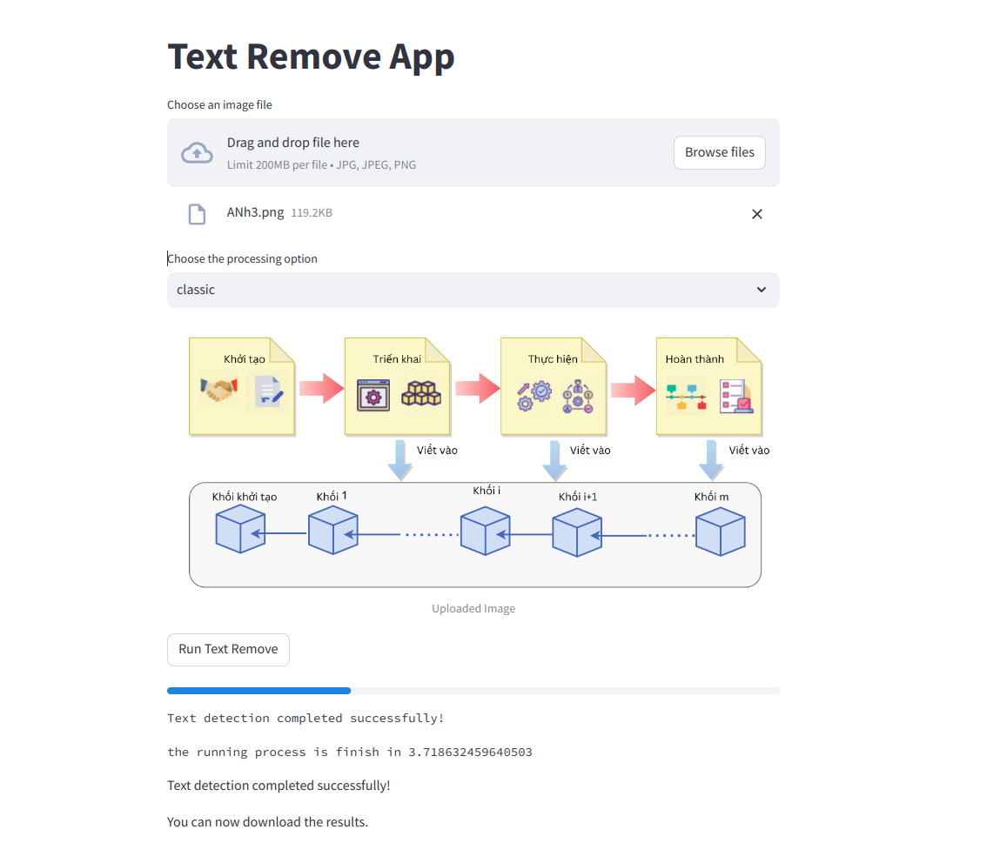

# Set environment
You need to clone this repo first and create conda virtual environment.
```bash
git clone https://github.com/nguyen-brat/text-remove.git
cd text-remove
conda create -n inpaint python==3.8
conda activate inpaint
sudo apt-get install libjpeg-dev zlib1g-dev
sudo apt install unzip
```

# Set up library
```bash
pip install -r requirements.txt
```

# Set up Craft

```bash
cd craft_pytorch
wget --no-check-certificate 'https://docs.google.com/uc?export=download&id=1Jk4eGD7crsqCCg9C9VjCLkMN3ze8kutZ' -O "craft_mlt_25k.pth"
gdown 1XSaFwBkOaFOdtk4Ane3DFyJGPRw6v5bO
cd ..
```

# Set up lama
```bash
cd lama
curl -LJO https://huggingface.co/smartywu/big-lama/resolve/main/big-lama.zip
unzip big-lama.zip
cd ..
```

# text detection with craft and remove with lama
```bash
bash config/text_detection.sh -s path/to/the/folder/remove/text \
                                -t path/to/the/folder/saved/result
```

# Example run with cpu
```bash
bash config/text_detection.sh -s test_folder -t target_test
```

# Run app using streamlit

```bash
streamlit run app.py
```

## App UI


# Folder structure

### Description of Key Files and Directories

- **config/**: Configuration files for the project.
- **craft_pytorch/**: Contains code related to CRAFT text detector using PyTorch.
- **image/**: Directory for storing image files used in the project.
- **lama/**: Directory related to the LaMa inpainting model.
- **mmocr/**: Contains files related to MMOCR (Multimodal OCR) toolkit.
- **myenv/**: Virtual environment for the project dependencies.
- **notebook/**: Jupyter notebooks for experimentation and prototyping.
- **target_test/**: Directory for target test files.
- **test_folder/**: Directory for test files.
- **.gitignore**: Git ignore file to specify which files and directories should be ignored by Git.
- **app.py**: Main application script.
- **draw_bb.py**: Script for drawing bounding boxes.
- **README.md**: The file you are currently reading.
- **requirements.txt**: List of project dependencies.